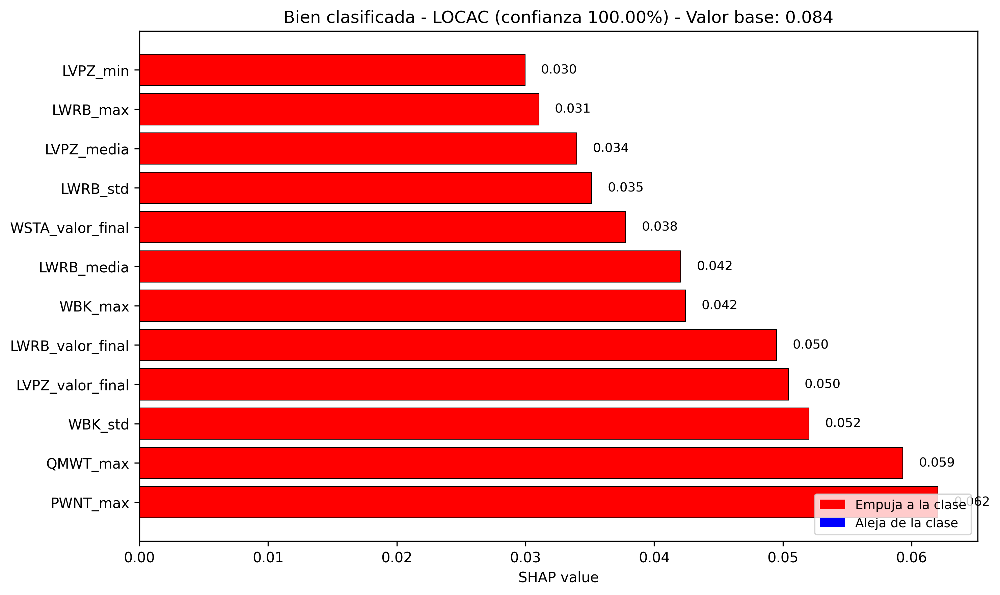
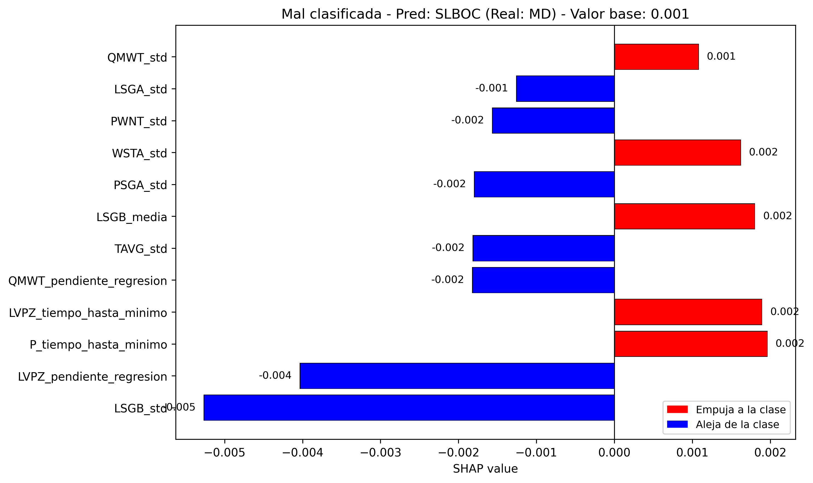

# 🏭 Clasificación de Accidentes Nucleares mediante Machine Learning

[](https://www.python.org/)
[](https://scikit-learn.org/)
[](https://shap.readthedocs.io/)
[](https://opensource.org/licenses/MIT)

## 📖 Descripción

Proyecto de Data Science aplicado al sector nuclear: clasificación automática de **18 tipos de accidentes** en un reactor PWR (Pressurized Water Reactor) a partir de las series temporales de 96 sensores, utilizando técnicas de **Machine Learning** e **interpretabilidad con SHAP**.

El proyecto cubre el ciclo completo de un proyecto de datos: **EDA**, **feature engineering**, **modelado** y **evaluación/interpretación**, con un modelo final que alcanza un **97% de accuracy** en test.

## 🎯 Objetivo

Desarrollar un sistema que, dado el comportamiento de los sensores de una central nuclear, sea capaz de **diagnosticar el tipo de accidente** que está ocurriendo. Este tipo de sistemas actúan como **herramientas de apoyo a la decisión** para los operadores de sala de control, reduciendo el tiempo de diagnóstico en situaciones críticas.

## 🗂️ Dataset

Se utiliza el dataset público **NPPAD** (*Nuclear Power Plant Accident Data*), que contiene:

- **96 sensores** monitorizados (temperatura, presión, flujos, niveles, radiactividad, etc.).
- **18 tipos de accidentes** simulados con PCTRAN (LOCA, ATWS, SGBTR, LOF, LACP, etc.).
- **1217 simulaciones** con diferentes severidades.
- Series temporales de hasta 500 segundos de duración.

Más información: [NPPAD en GitHub](https://github.com/thu-inet/NuclearPowerPlantAccidentData)

## 🏗️ Estructura del proyecto
```
proyecto_central_nuclear/
|-- data/
| |-- processed/ # Dataset final de características
| |-- README.md # Instrucciones para obtener los datos
|-- notebooks/
| |-- 01_EDA.ipynb # Análisis exploratorio de series temporales
| |-- 02_Feature_Engineering.ipynb # Extracción de características
| |-- 03_Modelado_Clasificacion.ipynb # Entrenamiento del modelo
| |-- 04_Evaluacion_Interpretacion.ipynb # SHAP y análisis de errores
|-- results/
| |-- imagenes/ # Gráficos generados
| |-- modelos/ # Modelo entrenado (.joblib)
| |-- columnas_seleccionadas.txt # Características seleccionadas
|-- scripts/
| |-- convertir_mdb_a_csv.py # Conversión de los datos originales
|-- src/
| |-- features.py # Feature engineering
| |-- model.py # Modelado y SHAP
| |-- utils.py # Utilidades (carga, gráficos)
|-- environment.yml # Dependencias del proyecto
|-- LICENSE
|-- README.md
```
## ⚙️ Tecnologías utilizadas

| Categoría | Herramientas |
|-----------|--------------|
| **Lenguaje** | Python 3.14 |
| **Análisis de datos** | pandas, NumPy |
| **Machine Learning** | scikit-learn (Random Forest) |
| **Interpretabilidad** | SHAP |
| **Visualización** | Matplotlib, Seaborn |
| **Entorno** | JupyterLab, Conda |

## 🔬 Metodología

El proyecto sigue cuatro fases claramente diferenciadas:

### 1️⃣ Análisis Exploratorio (EDA)
- Visualización de series temporales de los sensores clave.
- Identificación de patrones característicos de accidentes (ej. caída de presión en LOCA, subida de temperatura en LACP).
- Conclusión: 5 sensores son insuficientes → se amplía a 12.

### 2️⃣ Feature Engineering
- Selección de **12 sensores** que cubren primario, secundario, neutrónica y contención.
- Extracción de **9 estadísticas por sensor**: media, desviación, máx, mín, valor inicial, valor final, pendiente de regresión, tiempo hasta el máximo y hasta el mínimo.
- Generación de un dataset tabular de **1217 × 110** (108 características + accidente + severidad).

### 3️⃣ Modelado
- Selección de las **64 características más importantes** (89% de la importancia acumulada) mediante un Random Forest.
- Entrenamiento de un **Random Forest** final con validación cruzada estratificada (5 folds).
- **Accuracy en test: 97.13%**.

### 4️⃣ Evaluación e Interpretación
- **Matriz de confusión**: identificación de clases confundidas.
- **Análisis SHAP**: interpretación global y local de las predicciones mediante *waterfall plots*.
- **Análisis de errores**: las confusiones ocurren principalmente en clases minoritarias o físicamente similares.

## 📊 Resultados principales

| Métrica | Valor |
|---------|-------|
| **Accuracy en test** | 97.13% |
| **Accuracy en validación cruzada** | 98.25% ± 0.70% |
| **Características seleccionadas** | 64 (de 110) |
| **Clases** | 18 tipos de accidentes |

### Características más influyentes (según SHAP)
- `P_media` (presión media del RCS)
- `WBK_max` (flujo máximo de rotura)
- `TAVG_pendiente_regresion` (tendencia de la temperatura media)
- `LVPZ_min` (nivel mínimo del presurizador)

### Ejemplos de interpretación con SHAP

A continuación mostramos dos ejemplos de waterfall plots: uno para una muestra bien clasificada y otro para una mal clasificada. Las barras rojas empujan la predicción hacia la clase indicada, mientras que las azules la alejan.

#### Muestra bien clasificada: LOCAC (100% de confianza)



El modelo predice correctamente la clase `LOCAC` (Loss of Coolant Accident en el lazo frío) con una confianza del 100%. Las características más influyentes son:

- **`PWNT_max`** (flujo neutrónico máximo): 0.062
- **`QMWT_max`** (potencia térmica máxima): 0.059
- **`WBK_std`** (desviación del flujo de rotura): 0.052
- **`LVPZ_valor_final`** y **`LWRB_valor_final`** (nivel final del presurizador y del edificio de contención): 0.050

Todas las contribuciones son positivas (rojas), lo que indica que todas las señales de los sensores apuntan de forma consistente hacia la clase `LOCAC`. Esto explica la confianza del 100% del modelo.

#### Muestra mal clasificada: predicha como SLBOC (real MD)



En este caso, el modelo predice `SLBOC` (Steam Line Break Outside Containment) cuando la clase real es `MD` (Moderator Dilution). Las contribuciones son mucho más pequeñas (del orden de ±0.005), lo que indica que **el modelo no está seguro** de su predicción. Las características que empujan hacia `SLBOC` son principalmente `LSGB_media`, `WSTA_std` y `QMWT_std`, mientras que `LSGB_std`, `LVPZ_pendiente_regresion` y `P_tiempo_hasta_minimo` alejan la predicción de esa clase.

Este ejemplo ilustra una de las confusiones más comunes del modelo (`MD` ↔ `SLBOC`), que se debe a que ambos accidentes comparten patrones similares en los sensores del secundario y del primario. La baja magnitud de las contribuciones refleja la ambigüedad inherente a este tipo de muestras.
## 🚀 Cómo ejecutar el proyecto

### 1. Clonar el repositorio
```bash
git clone https://github.com/yazz-1/nppad-accident-classification.git
cd nppad-accident-classification
```

### 2. Crear el entorno Conda
```bash
conda env create -f environment.yml
conda activate central_nuclear
```

### 3. Obtener los datos
Sigue las instrucciones de `data/README.md` para descargar el dataset NPPAD y generar los CSVs procesados.

### 4. Ejecutar los notebooks
```bash
jupyter lab
```
Abre los notebooks en orden (`01_EDA.ipynb` → `04_Evaluacion_Interpretacion.ipynb`).

## 📌 Conclusiones

* El modelo alcanza una **accuracy superior al 97%** en la clasificación de 18 tipos de accidentes, con validación cruzada estable.

* **SHAP permite interpretar cada predicción**, lo cual es esencial en un dominio crítico como el nuclear, donde la transparencia es tan importante como la precisión.

* Las confusiones del modelo son **coherentes con la física del reactor** (ej. `MD` ↔ `SLBOC`, `RW` ↔ `RI`), lo que refuerza la confianza en el sistema.

* El proyecto demuestra la viabilidad de usar Machine Learning como **herramienta de apoyo a la decisión** en el diagnóstico de accidentes nucleares.

## 🔮 Posibles mejoras
* Incorporar más sensores específicos para accidentes de reactividad y del secundario.

* Añadir características de derivada temporal (segundo orden) para capturar transitorios rápidos.

* Ampliar el dataset con más muestras de clases minoritarias (`Normal`, `SP`).

* Calibrar las probabilidades para obtener valores más realistas.

* Explorar modelos alternativos (XGBoost, LightGBM) para comparar rendimiento.

## 👤 Autor

**Alejandro Rodríguez Salguero**

📧 Email: arodsal@proton.me

💻 GitHub: @yazz-1

🔗 [LinkedIn](https://www.linkedin.com/in/alejandro-r-63a7ba225/)

Graduado en Matemáticas (UNED) | Máster en Estadística e Investigación Operativa | Apasionado por el Data Science y las infraestructuras críticas.

## 📄 Licencia

Este proyecto está bajo la licencia **MIT**. Consulta el archivo [LICENSE](LICENSE) para más detalles.

## 🙏 Agradecimientos

* Al equipo de **THU-INET** por hacer público el dataset NPPAD.

* A la comunidad de **scikit-learn** y **SHAP** por las herramientas utilizadas.
